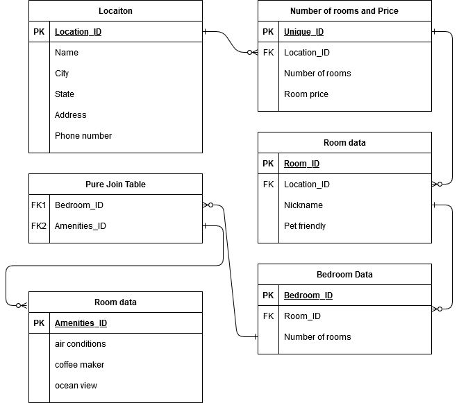

# AsyncInn

*Author: Enrique Hilst*

----

## Description
This is a C# console application.

---

### Getting Started
Clone this repository to your local machine.

```
$ git clone https://github.com/ehilst515/AsyncInn.git
```

### To run the program from Visual Studio:
Select ```File``` -> ```Open``` -> ```Project/Solution```

Next navigate to the location you cloned the Repository.

Double click on the ```AsynInn``` directory.

Then select and open ```AsynInn.sln```

---

### Visuals

#### Database Diagram 


#### Initial Diagram


